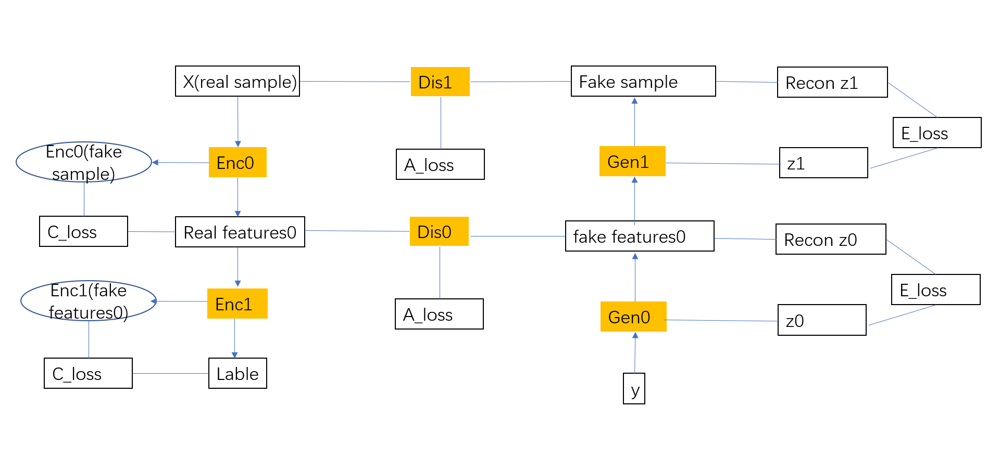
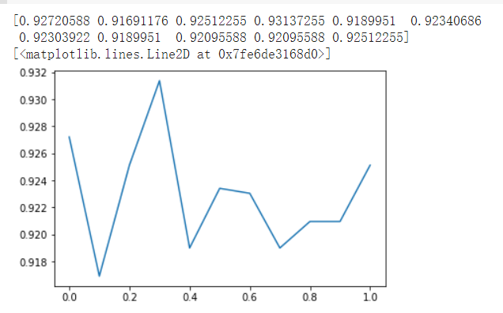

# Enlarge microbiome dataset using stack_GAN
## Background
The 16S rRNA abundance timeseries data used for prediction is small(hurdreds). So it is easy to suffer from overfitting. To solve the issue, the stack_GAN(generative adversarial network) is tried to conduce data augment. Then the Recurrent neural network(to be more specific, Long short-term memory) is used to do prediction. The dataset used is the same as in the Microbiome_Prediction, which server as the baseline for the prediction accurary.

## Three Loss Type
 - Adversarial loss
 - Conditional loss
 - Entropy loss

## Model List
| model|input|output|
|--|--|--|
| discriminator1|real/fake sample|[the probability that sample is real,z1 reonstruction] 
| discriminator0|real/fake feature0|[the probability that feature0 is real,z0 reonstruction] 
| generator0| fake z0, real lable|  fake feature0
| generator1| fake z1, feature0|  fake sample
| encoder0| real sample| real feature0
| encoder1| real feature0|predicted lable
| adversary0| gen0_inputs|[dis0(gen0_outputs),enc1(gen0_outputs)]
| adversary1| gen1_inputs|[dis1(gen1_outputs),enc0(gen1_outputs)]
## Training workflow
1. train the encoder
2. train the discriminator
3. train the adversary0

|Process|  
|--|
|  i) feed [real lables,z0] to gen0, get gen0_ouputs|
|ii) feed gen0_ouputs to dis0,enc1|
|iii) from dis0(gen0_outputs) ->get loss: binary,mse|
|iv) from enc1(gen0_outputs) ->get loss: categorical|
|**note**: the ground truth in iii) iv) is [real/fake, fake z0, real labels]|

4. train the adversary1

|Process|  
|--|
|i)  feed [feature0,z1] to gen1, get gen1_ouputs|
|ii) feed gen1_ouputs to dis1,enc0|
|iii) dis1(gen1_outputs) ->loss function: binary,mse|
|iv) enc0(gen1_outputs) ->categorical|
|**note**: the ground truth in iii) iv) is [real/fake, fake_z1, real_feature0]|

5. Design

6. Result

